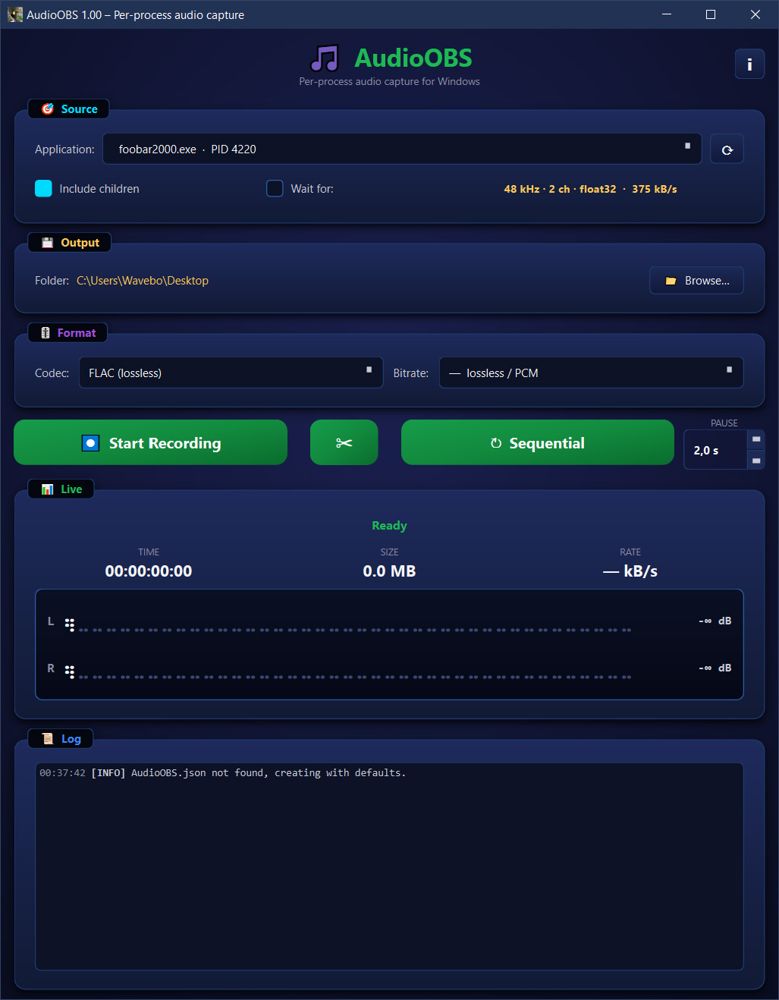

# AudioOBS

**A quiet observation lounge for your apps' audio.**

Per-process audio capture for Windows. Picks one running application and
records *only* its audio — no system mix, no microphone bleed, no other
apps. Output goes through `ffmpeg`, so you can save as FLAC, ALAC, MP3,
AAC, Opus, EAC3 or raw PCM.



---

## Features

- **Per-process capture** — pick any running app from the dropdown.
  An app only appears once it is actually playing audio; when the list
  is empty AudioOBS says so and points the way
- **"Wait for:" with history** — arm AudioOBS against an app that
  isn't running yet by `.exe` name. The Wait-for field is an editable
  combo box that remembers the apps you've waited for before, so you
  can re-pick them from the drop-down instead of retyping
- **Include child processes** — captures spawned helpers too (Chrome
  audio service, Spotify renderer, etc.)
- **Sequential / album mode** — auto-splits into individual track files
  when silence is detected between songs. Adjustable silence-gap
  spinbox right next to the button
- **Manual track-split** — scissors button closes the current file and
  starts a new one instantly, even when songs blend without a gap
- **Live VU meter** — Braille-glyph bars, per-channel peak hold,
  green/yellow/red zoning on a `-50 ... +4 dB` scale
- **Scrolling Spectrogram** — click the meter to toggle. Log-frequency
  waterfall display (20 Hz – 20 kHz), magma colour map, L/R panels.
  Pure NumPy / FFT under the hood
- **WASAPI format readout** — sample rate, channel count, sample depth
  and raw data rate of the currently captured source, shown live
- **Startup ffmpeg check** — on launch AudioOBS verifies ffmpeg is
  reachable. If it isn't, it explains what still works without it
  (live monitoring) and how to install it
- **Full save-state** — output folder, codec and bitrate, sequential
  pause-gap, last source, Wait-for state and history, meter view and
  window geometry are all stored in `AudioOBS.json` next to the EXE.
  A missing folder or stale value falls back to a safe default rather
  than blocking startup

---

## Requirements

| | |
|---|---|
| OS          | Windows 10 build 19041 (version 2004) or newer — older builds lack the Process Loopback API |
| Python      | 3.10+ (for running from source) |
| Audio enc.  | `ffmpeg.exe` on `PATH` (any recent build) |
| Python deps | `PySide6`, `numpy` |

> Without `ffmpeg`, recording is disabled, but live monitoring — source
> picking, VU meter, spectrogram and the WASAPI format readout — still
> works. AudioOBS checks for `ffmpeg` at startup and tells you how to
> install it if it is missing.

---

## Run from source

```cmd
pip install PySide6 numpy
python python\AudioOBS_1_00.py
```

The `python\` folder must contain:

- `AudioOBS_1_00.py` — the GUI
- `wincaptureaudio.py` — ctypes bindings
- `wincaptureaudio.dll` — the capture core (build instructions in
  `python\README.md`)
- `resources\icons\` — optional, contains the toucan icons (taskbar,
  About dialog, etc.). The app falls back gracefully if missing

## Build a standalone EXE

[Nuitka](https://nuitka.net/) wraps the whole thing into a single EXE
or a portable folder:

```cmd
pip install nuitka ordered-set zstandard

REM single-file (~150 MB, slower start)
build_onefile.bat

REM folder with EXE + DLLs (~250 MB, instant start)
build_standalone.bat
```

Output ends up under `build_dist\`. The `.bat` files are just
double-click wrappers around `python build.py --onefile` /
`--standalone`.

---

## How it works

```
+----------------+    +----------------------+    +------------+
|  Source app    |    |  wincaptureaudio.dll |    |  AudioOBS  |
|  (Spotify,     |--->|  WASAPI Process      |--->|  GUI       |
|  Chrome,       |    |  Loopback + Mixer    |    |  (PySide6) |
|  foobar2000…)  |    |  (C++)               |    |            |
+----------------+    +----------------------+    +------+-----+
                                                         |
                                                         | float32 PCM
                                                         v
                                                  +-------------+
                                                  |  ffmpeg     |
                                                  |  subprocess |--> .flac / .mp3 / .opus / ...
                                                  +-------------+
```

The DLL is adapted from
[bozbez/win-capture-audio](https://github.com/bozbez/win-capture-audio),
which was originally an OBS Studio plugin — that's where the "OBS" in
the name comes from. The current build pulls audio at the WASAPI mix
format (48 kHz / 2 ch / float32) and hands it to a callback. The
Python GUI pipes the PCM straight into a long-lived `ffmpeg`
subprocess via stdin.

A process only shows up in the source picker once it has an active
WASAPI audio session — i.e. once it has actually played a sound. An
app that is open but silent has no session for Windows to enumerate.
That is what **"Wait for:"** is for: it polls until the named `.exe`
opens a session and arms recording the moment it does.

VU meter and silence detection use `np.dot(x, x) / N` for one-pass
RMS. The spectrogram does `np.fft.rfft` on a Hann-windowed 2048-sample
slice each tick, maps log-frequency bins to display rows through a
precomputed index table, and pulls magma colours through a 256-entry
LUT — no Python loop on the hot path.

---

## Project layout

```
AudioOBS/
├── python/
│   ├── AudioOBS_1_00.py        # the GUI entry point
│   ├── wincaptureaudio.py      # ctypes bindings
│   ├── wincaptureaudio.dll     # built C++ capture core
│   ├── example_record.py       # minimal DLL-only demo
│   ├── resources/icons/        # toucan icons (.ico, .svg, .png)
│   └── README.md               # DLL build instructions (German)
├── src/                        # C++ sources for the DLL
├── include/                    # public C API header
├── CMakeLists.txt
├── build.py                    # Nuitka driver
├── build_onefile.bat
├── build_standalone.bat
├── CHANGELOG.md                # version history
├── LICENSE                     # GPL-2.0
└── README.md                   # this file
```

---

## License

GPL-2.0-or-later. The C++ capture core is adapted from
[win-capture-audio](https://github.com/bozbez/win-capture-audio) (GPL-2.0),
which forces GPL on the linked product. New files in this repository
are licensed the same way. See [`LICENSE`](LICENSE).

---

## Acknowledgements

- **[bozbez/win-capture-audio](https://github.com/bozbez/win-capture-audio)** —
  the WASAPI Process Loopback C++ code
- **[Microsoft WIL](https://github.com/microsoft/wil)** — modern C++
  helpers for Win32/COM
- **[FFmpeg](https://ffmpeg.org/)** — the entire encoding pipeline
- **[PySide6 / Qt](https://doc.qt.io/qtforpython-6/)** — the GUI
- **[NumPy](https://numpy.org/)** — VU/RMS math and the spectrogram FFT
- **[BTop](https://github.com/aristocratos/btop)** — Braille-glyph VU
  meter inspiration
- **[Audacity](https://www.audacityteam.org/)** — spectrogram display
  conventions
